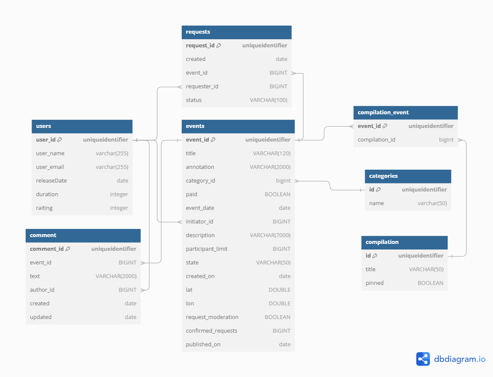
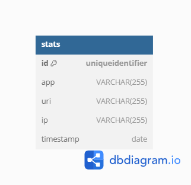

# java-explore-with-me
Сервис "Афиша", в котором возможно предложить какое-либо событие от выставки до похода в кино 
и собрать компанию для участия в нём.
В сервисе можно:
- управлять событиями;
- создавать подборки событий;
- оставлять комментарии к событиям;
- оставлять запросы на участие в событие;
- каждое событие настраивается с учетом требований его автора.

Применяемый стек технологий:
- Java 21;
- Spring Boot;
- PostgreSQL;
- Maven;
- Lombok;
- Postman;
- Hibernate;
- Spring Data JPA;
- Spring Web;
- Spring Validation;
- Docker.

Схема БД для сервиса "Афиша" (основной модуль):

Схема БД для сервиса "Афиша" (модуль статистики):

